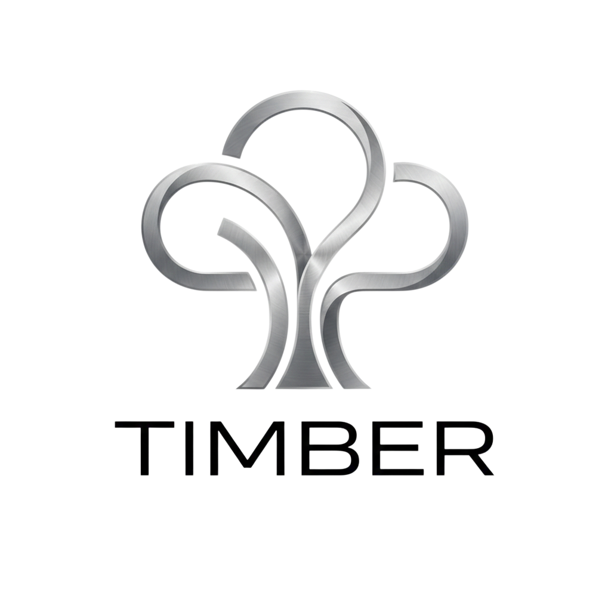
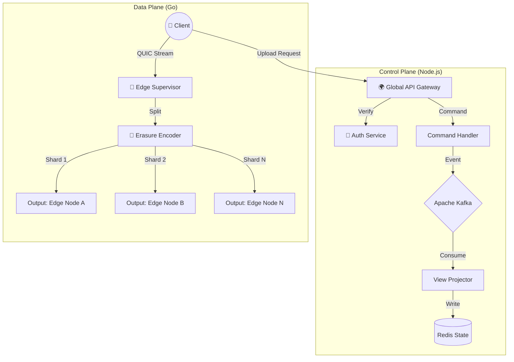
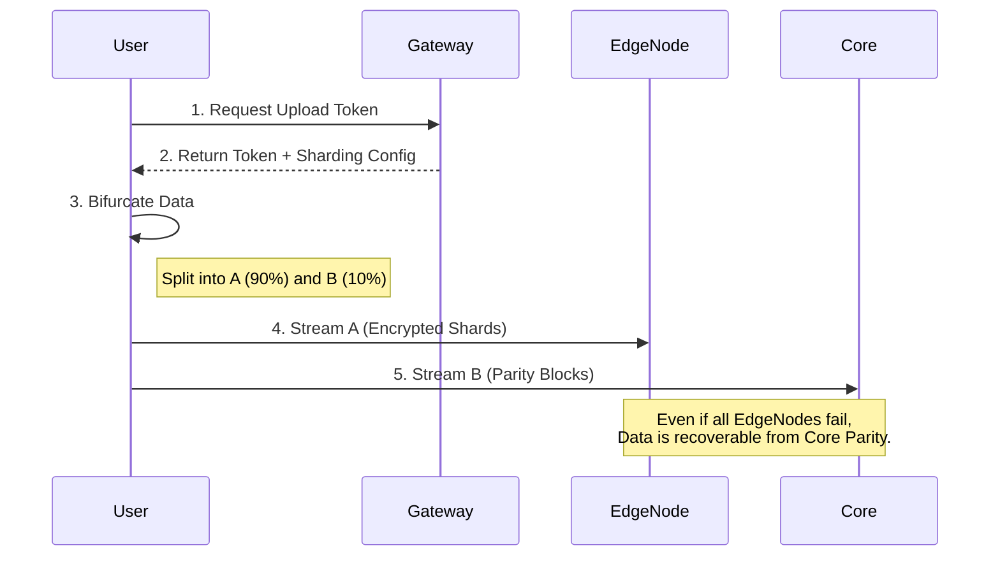

# Timber: Enterprise Distributed Cloud Platform
<div align="center">



**The "Unbreakable" Cloud Standard: Hyper-scalable, Self-healing, and Zero-Trust.**

[](./documentation/Timber_Enterprise_Architecture.md)
[](https://opensource.org/licenses/MIT)
[]()

[Enterprise Architecture](./documentation/Timber_Enterprise_Architecture.md) • [Dependencies](./DEPENDENCIES.md) • [Contributing](#contributing)

</div>

## 🚧 Current Development Status (Updated: Feb 8, 2026)

**Phase 2: The Storage Engine (In Progress)**

| Component | Status | Progress | Notes |
| :--- | :--- | :--- | :--- |
| **Monorepo** | ✅ Complete | 100% | `v2.0` Structure (Frontend/Backend) active. |
| **Frontend** | ⚠️ Partial | 30% | Skeleton Ready (`frontend/web`). Basic Dashboard UI implemented. needs API integration. |
| **Gateway** | ⚠️ Partial | 40% | Skeleton Ready (`backend/gateway`). `/api/upload/init` logic added. needs Auth middleware. |
| **Core Engine** | 🔨 Building | 20% | **Current Task**: Implemented Reed-Solomon Encoder & File Chunking. |

### 📋 detailed Todo List
- [x] **Phase 0: Foundation**
    - [x] Initialize Monorepo & Workspaces
    - [x] Set up React + Vite (`frontend/web`)
    - [x] Set up Node.js + Express (`backend/gateway`)
    - [x] Set up Go Module (`backend/core`)
- [ ] **Phase 1: Basic Logic**
    - [x] Dashboard UI (Dark Mode)
    - [x] Gateway Token Generation
    - [x] `cors` configuration
- [ ] **Phase 2: The Engine (Go)**
    - [x] **Step 1**: Implement Reed-Solomon Encoder
    - [x] **Step 2**: Implement File Chunking I/O
    - [x] **Step 3**: Implement QUIC Transport
    - [x] **Step 4**: Implement "Bifurcation" Protocol

---

## 🌟 Enterprise Architecture (Visualized)

Timber v2.0 is designed to be **Unbreakable**. Here is how the components interact:

### 1. High-Level Architecture
This diagram shows the flow from the User to the Edge Storage Nodes.



### 2. The "Bifurcation" Protocol
This is our secret sauce for security. Data is split *before* it leaves the client helper (or Edge Supervisor).



### 3. Reed-Solomon Erasure Coding
How we prevent data loss without standard backups.

```mermaid
graph LR
    Input[📄 Input File (100MB)] --> Split{Sliding Window}
    Split --> D1[Data 1]
    Split --> D2[Data 2]
    Split --> D3[Data 3]
    Split --> P1[Parity 1]
    Split --> P2[Parity 2]
    
    style P1 fill:#f96,stroke:#333
    style P2 fill:#f96,stroke:#333
    
    D1 -.-> Network
    D2 -.-> Network
    D3 -.-> Network
    P1 -.-> Network
    P2 -.-> Network
    
    Note[If D2 is lost, D1 + D3 + P1 can reconstruct it!]
```

---

## 🛠️ Technology Stack (The "Hard" Way)

| Component | Technology | Role |
| :--- | :--- | :--- |
| **Control Plane** | **Node.js + Kafka** | High-throughput event processing |
| **Data Plane** | **Go (Golang)** | Raw block storage & networking |
| **State** | **CockroachDB** | Geo-distributed strong consistency |
| **Orchestration** | **Kubernetes + Istio** | Zero-trust service mesh |
| **Observability** | **OpenTelemetry** | Distributed tracing |
| **Chaos** | **Chaos Mesh** | Continuous failure injection |

## 📚 Documentation
- **[📖 Enterprise Architecture v2.0](./documentation/Timber_Enterprise_Architecture.md)** - *Read this first!*
- [📦 Project Dependencies](./DEPENDENCIES.md)
- [🔧 API Reference (Protobufs)](./proto/README.md)
- [🔒 Security Pattern: Bifurcation](./docs/security.md)
- [🌪️ Chaos Engineering Guide](./docs/chaos.md)

## 🚀 Quick Start (Local Development)

### 1. Prerequisites
- Node.js 18+
- Go 1.25+
- Docker & Docker Compose

### 2. Installation
```bash
# Install dependencies for Frontend & Gateway
npm install

# Install dependencies for Core (Go)
cd backend/core && go mod tidy
```

### 3. Running the Stack
```bash
# Start the Monorepo (Frontend + Gateway)
turbo run dev
```
